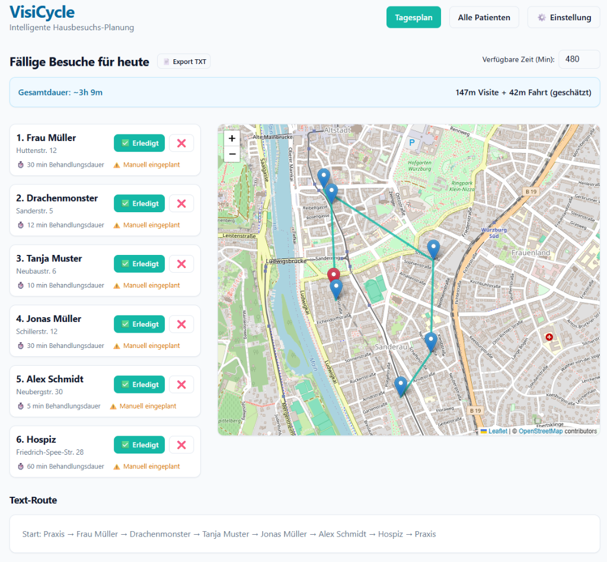

# VisiCycle - Intelligenter Hausbesuchs-Planer 🚴‍♂️🏥

**VisiCycle** ist eine moderne, datenschutzfreundliche Anwendung für medizinische Hausbesuche. Sie hilft Ärzten und Pflegepersonal, ihre täglichen Routen effizient zu planen, Patienten zu verwalten und Reisezeiten zu minimieren.

## ✨ Highlights

*   **100% Datenschutz:** Alle Patientendaten bleiben lokal auf Ihrem Gerät – keine Cloud, kein Tracking.
*   **Verschlüsselung:** Patientendaten werden mit AES-256 verschlüsselt in der lokalen Datenbank gespeichert.
*   **Intelligentes Routing:** Automatische Berechnung der optimalen Route (Nearest Neighbor TSP).
*   **Flexible Zeitplanung:** Individuelle Besuchsintervalle, manuelle Termine und Einmal-Besuche.
*   **Behandler-Management:** Mehrere Behandler mit eigener Farbcodierung und täglichem Zeitbudget.
*   **Snooze-Funktion:** Patienten flexibel verschieben.
*   **Backup & Restore:** Datenbank mit einem Klick sichern und wiederherstellen.
*   **LAN-Zugriff:** Andere Computer im Netzwerk können die App mitnutzen.

## 📸 Screenshots




---

## 🚀 Installation & Start (Portable Version)

**Keine Installation nötig! Kein Python, kein Node.js – einfach starten.**

### 1. Herunterladen

Laden Sie die Datei **`VisiCycle_Portable.zip`** aus diesem Repository herunter.

> 💡 **Direkter Download:** Klicken Sie auf die Datei `VisiCycle_Portable.zip` und dann auf „Download" (oder „Raw").

### 2. Entpacken

Entpacken Sie die ZIP-Datei in einen beliebigen Ordner, z.B. auf den Desktop oder nach `C:\VisiCycle`.

### 3. Starten

Doppelklicken Sie auf **`VisiCycle.exe`** im entpackten Ordner.

*   ✅ Der Server startet automatisch
*   ✅ Der Browser öffnet sich automatisch
*   ✅ Die Datenbank wird neben der EXE gespeichert
*   ⚠️ Das schwarze Konsolenfenster **NICHT schließen** (das ist der Server)

### 4. Erster Start

Beim ersten Start werden Sie aufgefordert, ein Passwort festzulegen. Dieses schützt Ihre Patientendaten.

### 5. Beenden

Schließen Sie einfach das schwarze Konsolenfenster.

---

## 🌐 Netzwerk-Zugriff (LAN)

Andere Computer im gleichen Netzwerk können die App über folgende URL erreichen:

```
http://<Ihre-IP-Adresse>:8555
```

Die IP-Adresse finden Sie z.B. über `ipconfig` in der Eingabeaufforderung.

---

## 💾 Backup & Sicherung

*   **Einfach:** Den gesamten `VisiCycle`-Ordner kopieren (inkl. `db.sqlite3`).
*   **In der App:** Unter ⚙️ Einstellungen → Backup & Restore können Sie die Datenbank exportieren und importieren.

---

## 🛠️ Für Entwickler

Falls Sie den Quellcode selbst bearbeiten möchten:

### Voraussetzungen

*   [Python 3.8+](https://www.python.org/downloads/)
*   [Node.js 16+](https://nodejs.org/)

### Backend starten

```bash
cd backend
pip install -r requirements.txt
uvicorn main:app --reload --host 0.0.0.0 --port 8555
```

### Frontend starten

```bash
cd frontend
npm install
npm run dev
```

Die App ist dann unter `http://localhost:5173` erreichbar (Frontend) mit Backend auf Port `8555`.

### Portable EXE selbst bauen

```bash
cd frontend
npm run build
cd ../backend
pip install pyinstaller
python build_exe.py
```

Die fertige portable Version wird im Ordner `VisiCycle_Portable/` erstellt.

---

## 🔧 Technologien

*   **Backend:** FastAPI, SQLAlchemy, SQLite, Uvicorn
*   **Frontend:** React, Vite, Leaflet (OpenStreetMap)
*   **Routing:** Geopy (Geocoding), Haversine (Entfernungen)
*   **Sicherheit:** Fernet/AES-256 Verschlüsselung (cryptography)
*   **Packaging:** PyInstaller (Portable EXE)

## 🔒 Datenschutz-Hinweis

VisiCycle speichert alle Daten ausschließlich in einer lokalen SQLite-Datenbank. Patientennamen und Adressen werden verschlüsselt gespeichert. Für die Adress-Suche (Geocoding) wird OpenStreetMap verwendet – dabei werden **niemals** Patientennamen übertragen, sondern lediglich die Adresse.

## 📝 Lizenz

MIT License
